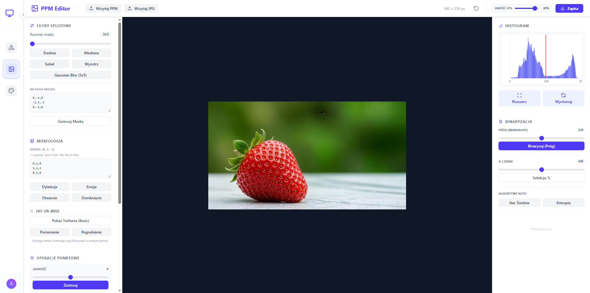
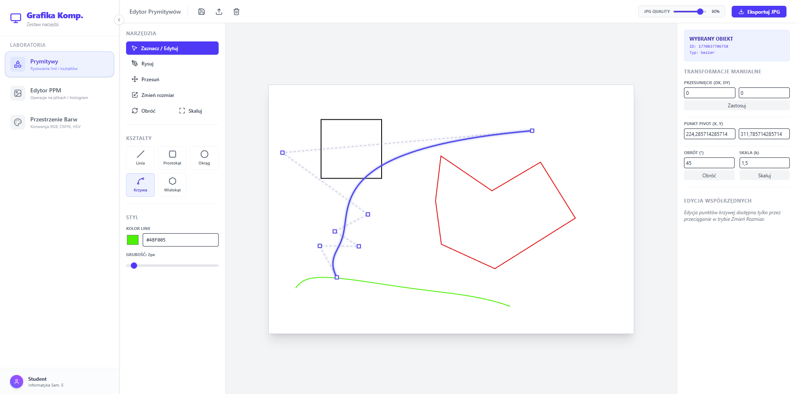

# GraphicsLab

Interaktywne laboratorium grafiki komputerowej — nowoczesne narzędzia edukacyjne do przetwarzania obrazów i rysowania prymitywów. Projekt pokazuje praktyczne techniki z przedmiotu Grafika Komputerowa: parsowanie plików PPM (P3/P6, także 16-bit), filtrowanie, binaryzację, przekształcenia punktowe, morfologię i proste narzędzia wektorowe.

Projekt studencki zrealizowany w ramach przedmiotu **Grafika komputerowa**.

**Zobacz demo na żywo**: [https://saikeno.github.io/graphics-lab/](https://saikeno.github.io/graphics-lab/)

**Najważniejsze cechy:**

- **Edytor PPM**: wczytywanie P3/P6 (ASCII i binarny), obsługa 16-bitowych wartości, konwersja do wewnętrznego formatu RGBA.
- **Operacje punktowe**: dodawanie/odejmowanie, mnożenie/dzielenie składowych, regulacja jasności.
- **Histogramy**: obliczanie i wykres histogramu, dopasowanie kontrastu, wyrównanie histogramu.
- **Binaryzacja**: metody progowania — ręczne, procent czerni, iteracyjne średnie, entropia (wyszukiwanie progów).
- **Filtry i morfologia**: konwolucje (rozmycia, wyostrzanie, Sobel), filtr medianowy, operacje morfologiczne (erozja, dylatacja, otwarcie, zamknięcie), hit-or-miss.
- **Rysowanie prymitywów**: linie, prostokąty, koła z obsługą zaznaczania i edycji.

**Repozytorium zawiera:**

- `src/` — aplikacja React + TypeScript (interfejs, komponenty laboratoriów)
- `src/components/Task2PPM.tsx` — zaawansowany edytor PPM (histogramy, filtry, morfologia)
- `src/utils/parsePPM.ts` — bezpieczny parser PPM obsługujący P3, P6 i 16-bitowe komponenty
- `testing/` — przykładowe pliki PPM do testów i demonstracji

**Technologie**

- Framework: `React` + `TypeScript`
- Bundler: `Vite`
- Stylowanie: `Tailwind CSS`
- Grafika 3D (opcjonalnie): `three` (w zależności od ćwiczeń)

## Szybki przewodnik po funkcjach

- Wczytywanie obrazu: przyciski "Wczytaj PPM" / "Wczytaj JPG". Parser obsługuje komentarze i różne warianty nagłówków.
- Histogram: automatyczny wykres, możliwość wyznaczenia progu (binaryzacja) i zaznaczenia go na wykresie.
- Filtry: wybierz gotowy filtr (średni, medianowy, Sobel, wyostrzanie) lub wprowadź własną maskę konwolucyjną.
- Morfologia: edytuj kernel w polu tekstowym (np. `0,1,0\n1,1,1\n0,1,0`) i zastosuj erozję/dylatację lub operacje otwarcia/zamknięcia.
- Eksport: zapisz wynik jako JPEG (regulacja jakości) lub wyeksportuj jako PPM.

## Przykładowe pliki testowe

W katalogu `testing/` znajdują się przykładowe pliki PPM (P3/P6, różne wielkości i komentarze). Użyj ich do sprawdzenia parsera i algorytmów przetwarzania.
